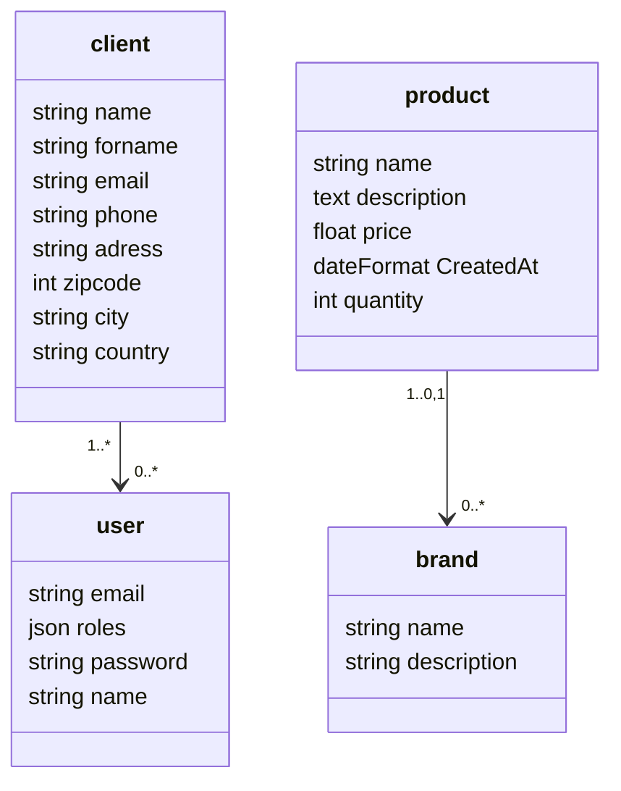

# Bilmo

- [Bilmo](#bilmo)
  - [INSTALLATION](#installation)
    - [__Download or clone__](#download-or-clone)
    - [__Install the project__](#install-the-project)
    - [__Create the database__](#create-the-database)
    - [__Generate the SSL keys__](#generate-the-ssl-keys)
      - [__You are ready to use your API!__](#you-are-ready-to-use-your-api)
  - [Modèle de Conceptuel de Données](#modèle-de-conceptuel-de-données)

## INSTALLATION
### __Download or clone__
Download zip files or clone the project repository with github ([see GitHub documentation](https://docs.github.com/en/github/creating-cloning-and-archiving-repositories/cloning-a-repository)).

### __Install the project__
1.  If needed, install __Composer__ by following [the official instructions](https://getcomposer.org/download/).
2.  In your cmd, go to the directory where you want to install the project and install dependencies with composer:
```
$ cd some\directory
$ composer install
```
Dependencies should be installed in your project (check _vendor_ directory).

### __Create the database__
1. If the database does not exist, create it with the following command in the project directory:
```
$ php bin/console doctrine:database:create
```
2. Create database structure thanks to migrations:
```
$ php bin/console doctrine:migrations:migrate
```
3. Install fixtures to have first contents and your admin account (update the fixtures files before if needed):
```
$ php bin/console doctrine:fixtures:load
```
Your database should be updated with contents. 
### __Generate the SSL keys__
1. Start by creating a jwt folder in the config / folder
```
$ mkdir config/jwt
```
2. We will then generate the private key with openssl:
```
$ openssl genrsa -out config/jwt/private.pem -aes256 4096
```
The console will ask you to enter a pass phrase, it's like a password to secure your token, I'll enter iwebprod, in production you have to choose a more secure pass phrase. Once you have chosen your pass phrase, validate it and enter it again to confirm.

3. You must then generate the public key:
```
$ openssl rsa -pubout -in config/jwt/private.pem -out config/jwt/public.pem
```
Enter the same pass phrase as earlier and it's good.
#### __You are ready to use your API!__ 
## Modèle de Conceptuel de Données
<!-- [](https://mermaid.live/edit#pako:eNqNUstSwzAM_BWPjkzboRxzYIbH8ANw9EXYamtI7CDLQOn037GTtilNB_DJWW3k3ZU2YIIlqMDUGOO9wyVjM32_UtqrfKxjMuKCV0-32veYqR15URrms9mFhun0WsNld1UpEvekloNNZse6nMw7njoQnxm93bfLD-_5mx4rJwo7v1QeGxpAoU9RlqJh1xZZQ2VRB5TcxpkjukWhh8BNrtwx5Q97I0PVZRdvCb04WffodvBYRBU7Y0XUoKsH9CXmdDjUFEfMNjf5CGx_MXXyYp_tXynswEXgs_iJwL2YVfBjLlqmGH9m8uXashQjrjnkdAyG5IXP59dN-Z9mRkPdwgQayrNzNq9n10WDrCj_C1W-WuRXDdoXHiYJj2tvoBJONIHUlsnvthmqBdaRtt933eVe) -->
