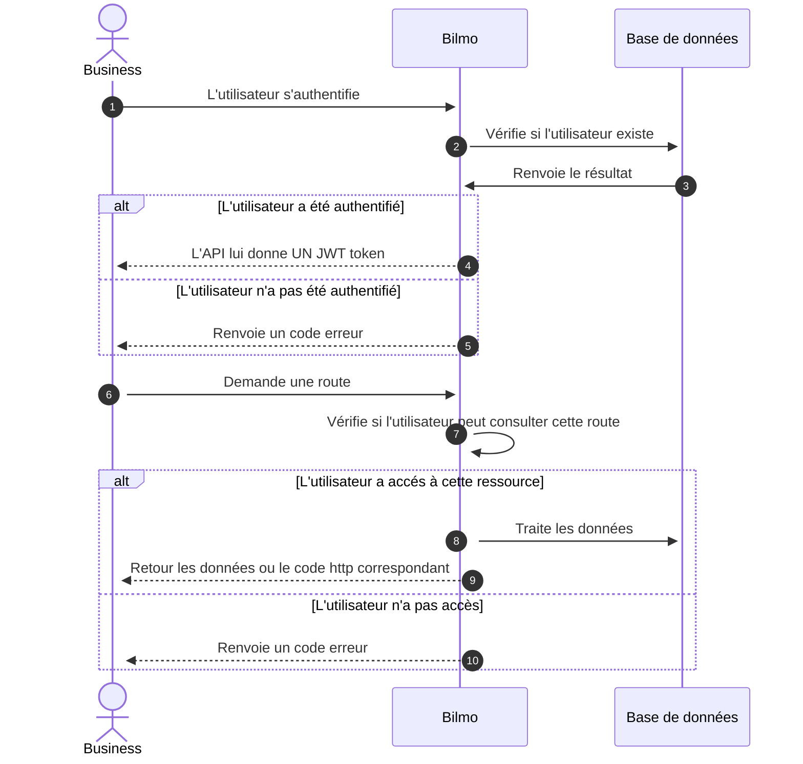
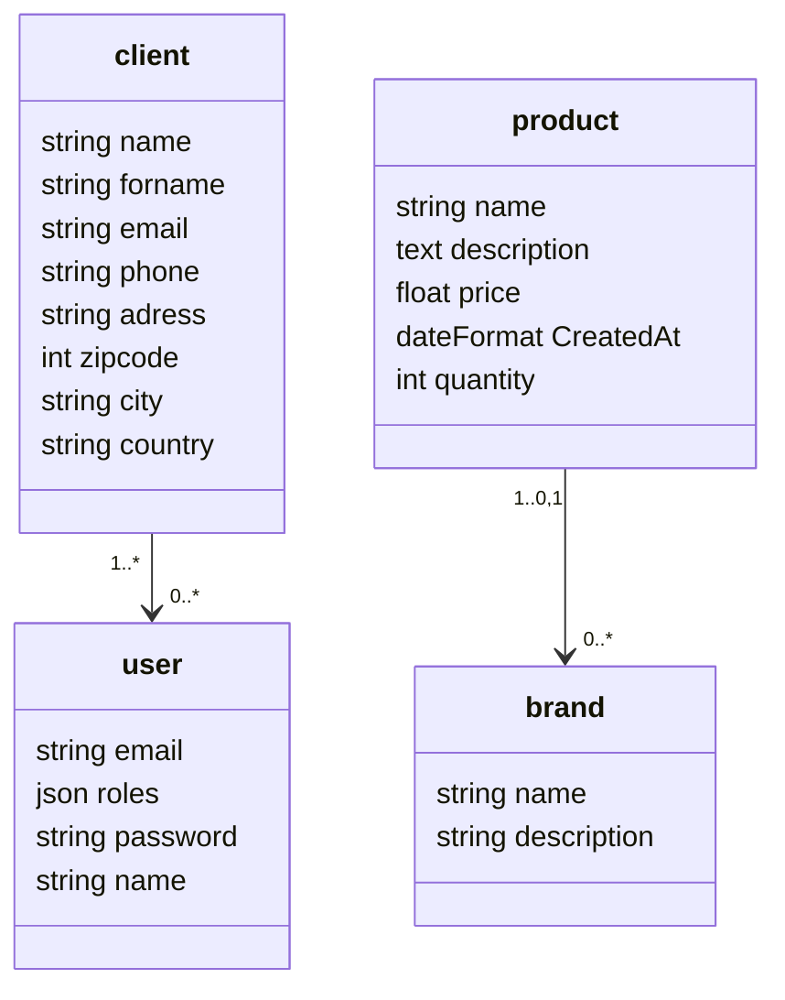

## Digramme de Séquence

```mermaid
sequenceDiagram
    autonumber
    actor V as Business
    participant API as Bilmo
    participant BDD as Base de données
    V->>+API: L'utilisateur s'authentifie
    API->>+BDD: Vérifie si l'utilisateur existe 
    BDD->>+API: Renvoie le résultat
    alt L'utilisateur a été authentifié
    API-->>+V:  L'API lui donne UN JWT token
    else L'utilisateur n'a pas été authentifié
    API-->>+V: Renvoie un code erreur
    end
    V->>+API: Demande une route
    API->>API: Vérifie si l'utilisateur peut consulter cette route
    alt L'utilisateur a accés à cette ressource
    API->>+BDD: Traite les données 
    API-->>+V:  Retour les données ou le code http correspondant
    else L'utilisateur n'a pas accès
    API-->>+V: Renvoie un code erreur
    end
```
## Modèle de Conceptuel de Données
<!--  -->

```mermaid
classDiagram-v2 
    direction TB

    client "1..*"-->"0..*" user
    product "1..0,1"--> "0..*" brand
    class product{
        string name
        text description
        float price
        dateFormat CreatedAt
        int quantity
    }

    class user{
        string email
        json roles
        string password
        string name
    }

    class client{
        string name
        string forname
        string email
        string phone
        string adress
        int zipcode
        string city
        string country
    }

    class brand{
        string name
        string description
    }
```